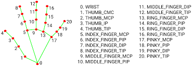
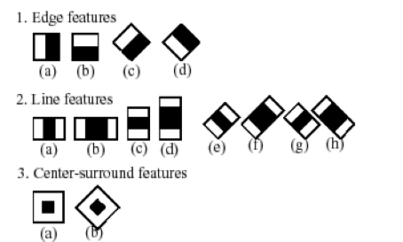

 # **Now** **I** **Understand**
 ##A New Type of Sign Language Translator

 **Ezra** **Huska**

 ## **Abstract**

357 000, that is the estimated number of deaf Canadians. Also, there is
a shortage of sign language translators/interpreters. This means many
people are unable to communicate properly with others, since sign
language is many peoples only language. These people can feel isolated
and due to isolation, have a higher risk of mental health issues. In
order to help solve these challenges, I worked to create a digital sign
language translator. While others have attempted the challenge of making
a sign language translator in the past, I made 2 major improvements over
them. The use of face detection and the detection and translation of
words (full, moving signs). With a combined approach, using Machine
learning and specifically purpose Neural Networks. In practice it is
able to translate sentences from ASL into English, allowing me to create
a translator and an assistant. While still in the early stages of
development this project has the potential to help thousands of people
in Canada and millions around the world.

## Table of contents: 
-Why

-Problems with existing projects 

-How

-Face detection 

-Words

-What (What I did) 

-Conclusion

-What’s Next

-Thanks, Bibliography

## **Why**

Did you know that nearly **20%** of the world’s population has hearing
loss and **6.1%** is deaf? Did you also know that according to the
national deaf centre, sign language translators are in short supply.
These two facts lead to a need for a **digital** **Sign** **Language**
**translator.**

Quickly, to show you in perspective there are about 11 000 000
culturally deaf people in the USA and only about 10 000 registered sign
language translators. That is about 1 for every 1 100 people. In Canada
there are about 357 000 culturally deaf people and about 647 registered
interpreters. About 1 for every 560. Let me ask you, does that seem
fair, does that sound like there is enough? For me the answer is a
definite no.

My project aims to solve this by creating a digital translator so that
it is not always needed to have a sign language translator present. The
original idea was to create a solution for a retail or restaurant kind
of setting. But now we see how useful this could be in many other areas.

The reason I am doing this specific project today is because I have seen
other attempts at the goal of a sign language translator, but I think
that all these projects have one big flaw. Most previous attempts at
this goal have used machine learning, but these can currently only be
trained with static images even though they have a live output. The big
flaw with this is the fact the Sign Language is not stationary, and most
signs require movement and specific hand location in relation to the
face. I have been working on something that mixes both machine learning
and some math to allow mobile signs.

## **Problems** **with** **existing** **projects**

There are two main problems with existing digital sign language
translators, lack of face, and lack of movement. There is also one major
problem with most existing systems.

### **1.** **Lack** **of** **face**

Simply put by a former sign language interpreter, “the grammar is on
your face.” This is after being asked if you need to see a face when
translating sign language. (commenting on digital sign language
translators that exist) Along with the fact that many signs use the
face, this is very necessary. Also, the face is useful for finding the
right position a hand should be in. You can read how I solve this
problem in the “Face Detection” section.

### **2.** **Lack** **of** **movement**

As I commented on earlier and am repeating, sign language gets most of
its meaning from the movement of the hands. This is about equal if not
more important than the gestures/signs themselves. My solution to this
problem can be found in the “Words” section.

The last main problem is different from the others, it is less of a
problem, but it seems to be a major misunderstanding with sign language.
This of course is **finger** **spelling.** Although you can speak in
sign language using finger spelling it is very impractical. Along with
that it is slow. It is only necessitated because of the lack of the two
things listed above.

## **How**

To make this project, I used over 275 lines of code split into 4 main
steps from taking an input frame and giving an output frame.

### **1.** **Data** **Collection**

First, the frame is taken in from the camera, then it is put through a
pre-trained neural network to detect if there is a hand in frame. In
this stage the number of hands, the position of the hands in relation to
the head, and the 'hand landmarks' location on the hand. Specifically,
there are 21 hand landmarks for each hand that have to be located.

It also looks for faces, but instead of detecting an actual face, the
patterns of darkness that resemble a face are detected. (See Face
detection section)

### **2.** **First** **Usage**

Next, the information is passed on to a part where it converts the
location of hand landmarks on a hand to each other. Then it just does
simple subtraction to find out whether a finger is up or down, crossed
over each other, etc.

### **3.** **Advanced** **Translation**

Then all that information is used to either make single letters or whole
words. 1. Letters: The information gathered from step 2 is used to make
quite accurate

approximations of if a hand is open, closed, in one of the letter
shapes, or if it is in a static word position.

2\. Words: The information from the letters goes here and is used to
make the more complex words. To add words with motion I used many
variables to say when it is here, then here. (More in Words section)

### **4.** **Output**

Finally, the display. I send all the information back to be displayed or
used for later.

## **Face** **Detection**

This is done by a classifier, a classifier is a pre-trained program that
detects objects, if it sees that object, it outputs “1” and “0”
otherwise. This classifier consists of several simpler classifiers
called stages, applied over the region until the object is rejected or
all the stages are passed. The basic classifiers are the decision tree
classifiers with at least 2 leaves. Haar-like features are the input to
the basic classifiers.

Haar wavelet is a sequence of rescaled square-shaped functions proposed
by Alfred Haar. Later the idea of Haar-like features came from Haar
wavelets. They are like convolution kernels of Neural Networks.

Instead of detecting an actual face, it detects the patterns of darkness
that are commonly found on faces. For example, the region of the eyes is
darker than the region of the forehead. For this, we first have to
convert an image into grayscale. This is done by a basic computer vision
software called OpenCV.

A detection window or a Haar frame is moved over the image, trying the
Haar features of every size, every type at every location of every
frame. Each feature gives a number obtained by subtracting the sum of
pixels under the white rectangle from the sum of pixels under the black
rectangle.

This difference is then compared to a threshold that determines whether
this is a good match or not. A frame that matches a predefined number of
features is considered to be a frame with a face.

## **Words**

To understand How I made my project recognize words, you first must
understand how it detects letters.

To detect letters my project finds the ‘21 hand landmarks’ although it
only keeps 9 for each hand(the tops/finger tip and the bottom/knuckle
closest to the wrist. For example, 5 and 8 for the index finger). Then
it is put through what is like a Neural Network that I personally made.
It uses the tip of the finger and sees if it is in a square-ish range
around another point, usually on the bottom of the finger. This is then
repeated for all the fingers and the thumb. For some letters there is
much more of this to be done than others.

The main problem that this solves is how to explain the position of a
hand in relativity to another instead of relative to the frame. But to
do words it is not as easy, I have to explain the position of a hand in
relation to itself and to where it was before it moved. More
specifically, to recognize words it first sees if the hand is in the
right “gesture” or letter, then it sees if it has moved the right
approximate distance away. Even with this ability, to avoid a lot of
troubles and latency, I skipped the small movements that are in sign
language and only accounted for the more grand ones.

## **What**

As a sign language interpreter told me, **"The** **grammar** **is**
**on** **your** **face"** and the fact that **movement** **is** **a**
**key** **function** of sign language. These are the main two things I
kept in mind while making a digital sign language translator. These are
also the **two** **main** **improvements** that this project has,
allowing it to potentially use the full sign language repertoire.

Though I only started this particular project about one month ago, I
have done many things that many others have failed in the past. With
signs like “my”, “I” (the word not the letter), and “hello” using the
face as a reference to tell if it is that sign as far as I know have not
been done in the past. Along with signs like “hello” and “want” using
movement, I have not seen done in the past.

These are the letters, numbers, and words it can currently recognize:
letters: a, b, d, f, h, i, l, o, r, s, u, v, w, y,

numbers: 1, 2, 3, 4, 5, 6, 7, 8, 9

words: hello, my, name(is), ILY (I Love You), I, want I plan to expand
these in the very near future

With those I was able to get my project to recognize a few sentences and
have reactions to them.

## **Conclusion**

My project has made two leaps for the future of digital sign language
translation, face detection and mobile signs (Full words). These two
things have leapfrogged the digital sign language translation technology
into new heights. Even with my small vocabulary and short time frame, it
has been able to detect and use full sentences worth of full words in
sign language.

As I have mentioned before, about **6.1%** of the world’s population is
deaf. Studies have shown that due to the language barrier there is an
increased rate of psychiatric disorders, and that can lead to a
**higher** **risk** **of** **suicide**, than people who can hear. But
there is hope! With projects like this the world can become a more
welcoming and inclusive place.

## **What’s** **next**

This project is not done and there are 3 main things that could be done.

###**1.** **Expanded** **vocabulary**

Sign language is a large language with between 40,000 and 140,000 words.
So, the vocabulary could be expanded to use more of these words.

###**2.** **Accuracy** **and** **speed**

With many advancements and fine tuning, the overall accuracy and speed
could improve drastically.

###**3.** **Accessibility**

This could be made into a phone app that would allow this technology to
be used wherever, and by many people.

## Thanks

I would just like to thank Mr. Thorlakson for lending a helping hand all
throughout the project and for the hardware I ran it on.

I would also like to thank my parents for helping me through the signing
up and through keeping me going. I would also like to thank them for
helping set up my backboard.

I would finally also like to thank all the judges and staff for hosting
this year’s M.S.S.S. It can't be done without them.

## Bibliography

World Health Organization. (n.d.). *Deafness* *and* *hearing* *loss*.
World Health Organization.
[<u>https://www.who.int/health-topics/hearing-loss#tab=tab_1</u>](https://www.who.int/health-topics/hearing-loss#tab=tab_1%C2%A0)

Shukla, A., Harper, M., Pedersen, E., Goman, A., Suen, J. J., Price, C.,
Applebaum, J., Hoyer, M., Lin, F. R., & Reed, N. S. (2020, May).
*Hearing* *loss,* *loneliness,* *and* *Social* *Isolation:* *A*
*systematic* *review*. Otolaryngology--head and neck surgery : official
journal of American Academy of Otolaryngology-Head and Neck Surgery.
[<u>https://www.ncbi.nlm.nih.gov/pmc/articles/PMC8292986/</u>](https://www.ncbi.nlm.nih.gov/pmc/articles/PMC8292986/)

Canada - wasli. (n.d.-a)<u>.
https://wasli.org/wp-content/uploads/2013/06/246_canada-country-report.pdf</u>

*Statistics* *on* *deaf* *Canadians*. Canadian Association of the Deaf -
Association des Sourds du Canada. (2022, February 4).
<u>https://cad-asc.ca/issues-positions/statistics-on-deaf-canadians/</u>

(N.d.). mediapipe.readthedocs.io. photograph. Retrieved
fro[m](https://mediapipe.readthedocs.io/en/latest/solutions/hands.html.%C2%A0)
[<u>https://mediapipe.readthedocs.io/en/latest/solutions/hands.htm</u>](https://mediapipe.readthedocs.io/en/latest/solutions/hands.html)[<u>l</u>.](https://mediapipe.readthedocs.io/en/latest/solutions/hands.html.%C2%A0)

Mudgal, V. (2021, June 12). *Real-time* *gesture* *recognition* *using*
*Google’s* *MediaPipe* *hands - add* *your* *own* *gestures*
*\[tutorial* *\#1\]*. Medium.

[<u>https://mudgalvaibhav.medium.com/real-time-gesture-recognition-using-googles-mediapipe-hands-add-your-own-gestures-tutorial-1-dd7f14169c19</u>](https://mudgalvaibhav.medium.com/real-time-gesture-recognition-using-googles-mediapipe-hands-add-your-own-gestures-tutorial-1-dd7f14169c19%C2%A0)

*This* *is* *how* *a* *Haar* *Feature* *is* *applied* *to* *an* *image*.
(n.d.). photograph,

[<u>https://medium.com/@rhugwedanshedge/face-detection-using-haar-cascade-classifier-in-opencv-and-python-d6318d0e189a</u>](https://medium.com/@rhugwedanshedge/face-detection-using-haar-cascade-classifier-in-opencv-and-python-d6318d0e189a)
